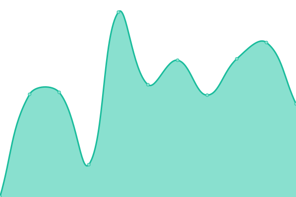

# [📈 Live Status](https://98bishopmal.github.io/Uptime): <!--live status--> **🟧 Partial outage**

This repository contains the open-source uptime monitor and status page for [98bishopmal](https://98bishopmal.github.io/Uptime), powered by [Upptime](https://github.com/upptime/upptime).

With [Upptime](https://upptime.js.org), you can get your own unlimited and free uptime monitor and status page, powered entirely by a GitHub repository. We use [Issues](https://github.com/98bishopmal/Uptime/issues) as incident reports, [Actions](https://github.com/98bishopmal/Uptime/actions) as uptime monitors, and [Pages](https://98bishopmal.github.io/Uptime) for the status page.

<!--start: status pages-->
<!-- This summary is generated by Upptime (https://github.com/upptime/upptime) -->
<!-- Do not edit this manually, your changes will be overwritten -->
<!-- prettier-ignore -->
| URL | Status | History | Response Time | Uptime |
| --- | ------ | ------- | ------------- | ------ |
|  Woodeys Trees | 🟩 Up | [woodeys-trees.yml](https://github.com/98bishopmal/Uptime/commits/HEAD/history/woodeys-trees.yml) | 

 1757ms
     
 | 

<a href="https://uptime.thebishops2010.co.uk/history/woodeys-trees">100.00%</a>
    

|  TheBishops | 🟥 Down | [the-bishops.yml](https://github.com/98bishopmal/Uptime/commits/HEAD/history/the-bishops.yml) | 

 1931ms
     
 | 

<a href="https://uptime.thebishops2010.co.uk/history/the-bishops">99.85%</a>
    

|  CCTV | 🟩 Up | [cctv.yml](https://github.com/98bishopmal/Uptime/commits/HEAD/history/cctv.yml) | 

 509ms
     
 | 

<a href="https://uptime.thebishops2010.co.uk/history/cctv">99.85%</a>
    

|  RMM | 🟥 Down | [rmm.yml](https://github.com/98bishopmal/Uptime/commits/HEAD/history/rmm.yml) | 

 368ms
     
 | 

<a href="https://uptime.thebishops2010.co.uk/history/rmm">99.85%</a>
    

|  Portainer | 🟥 Down | [portainer.yml](https://github.com/98bishopmal/Uptime/commits/HEAD/history/portainer.yml) | 

 289ms
     
 | 

<a href="https://uptime.thebishops2010.co.uk/history/portainer">99.85%</a>
    

|  BitWarden | 🟥 Down | [bit-warden.yml](https://github.com/98bishopmal/Uptime/commits/HEAD/history/bit-warden.yml) | 

 336ms
     
 | 

<a href="https://uptime.thebishops2010.co.uk/history/bit-warden">99.85%</a>
    

|  SpamReport | 🟥 Down | [spam-report.yml](https://github.com/98bishopmal/Uptime/commits/HEAD/history/spam-report.yml) | 

 536ms
     
 | 

<a href="https://uptime.thebishops2010.co.uk/history/spam-report">99.85%</a>
    

|  Wiki | 🟥 Down | [wiki.yml](https://github.com/98bishopmal/Uptime/commits/HEAD/history/wiki.yml) | 

 466ms
     
 | 

<a href="https://uptime.thebishops2010.co.uk/history/wiki">99.85%</a>
    

<!--end: status pages-->

[**Visit our status website →**](https://98bishopmal.github.io/Uptime)

## 📄 License

- Powered by: [Upptime](https://github.com/upptime/upptime)
- Code: [MIT](./LICENSE) © [98bishopmal](https://98bishopmal.github.io/Uptime)
- Data in the `./history` directory: [Open Database License](https://opendatacommons.org/licenses/odbl/1-0/)
